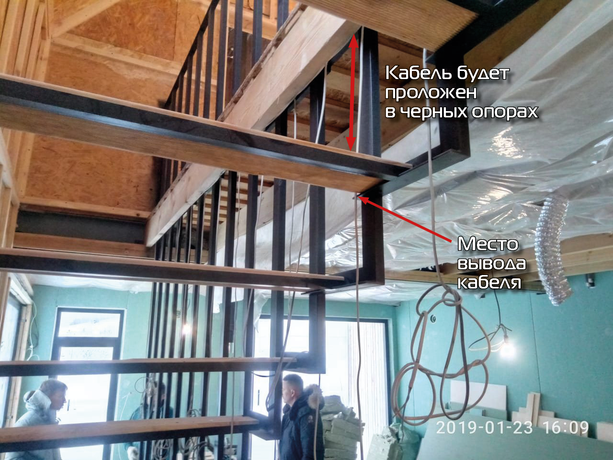

# Как сделать подсветку лестницы за 25000 рублей

Для создания эффекта, каждая ступенька подключается отдельным кабелем. Кабели идут к контроллеру, создающему эффект. Можно подключить 24 ступеньки. У нас их 15.

**Было использовано:**

* Лента 12В.
* Алюминиевый профиль для ленты.
* Блок питания - 12В на 200Вт.
* Кабель ШВВП 2х0.75 (от щита до лестницы).
* Экранированный Ethernet кабель Cavel LAN541-FTP.
* Гофра 16 мм.
* Контроллер Smartstair24.
* Расходники (клипсы для гофры, термоусадки, флюс и пр.)


В конце статьи - общая смета и ссылки.


## Подготовка лестницы

* Протянуть кабели к ступенькам.
* Протянуть кабели к датчикам высверлить подрозетники.
* Выпилить в ступеньках место под профиль для ленты.

Протяжкой кабеля занимались электрики. Мы обозначили места вывода. Для питания лент использовали ШВВП 2х0.75. Для датчиков - Ethernet кабель Cavel LAN541-FTP.\

<figure><figcaption></figcaption></figure>
