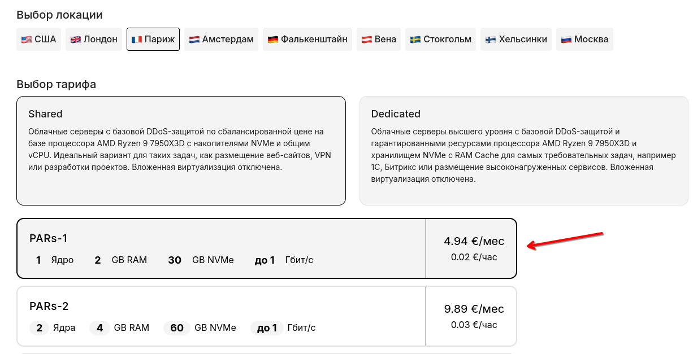

# 🎦 Установка TorrServer

### Развертывание TorrServer за несколько минут

Для начала подготовим сервер с **установленным пакетом TorrServer**. Это можно сделать **двумя** **разными способами**. Вы можете выбрать наиболее подходящий для Вас.

#### &#x20; 1.1 Покупка необходимого тарифа с предустановленным TorrServer <a href="#id-1.1-pokupka-neobkhodimogo-tarifa-s-predustanovlennym-torrserver" id="id-1.1-pokupka-neobkhodimogo-tarifa-s-predustanovlennym-torrserver"></a>


Для этого нам потребуется купить необходимый сервер в желаемой локации. В нашем случае это будет базовый тариф **PARs-1 в Париже:**

<figure><figcaption></figcaption></figure>

Переходим в раздел **«Предустановленного ПО»:**

<figure><figcaption></figcaption></figure>

Указываем нужный нам **скрипт TorrServer:**

<figure><figcaption></figcaption></figure>


Установка ОС будет произведена согласно указанной ОС в скрипте предустановленного ПО, в данном случае будет установлен Ubuntu 22.04 + TorrServer


Ставим желаемый срок аренды по **часам или месяцам**, при необходимости отключаем услугу **«Бекапы»** и жмём кнопку **оплатить:**

<figure><figcaption></figcaption></figure>


Отлично. Теперь после активации вашего сервера вы сможете войти в панель TorrServer. Мы расскажем об этом подробнее **в пункте 2 («**&#x412;ход в панель TorrServe&#x72;**»).**


#### 1.2 Переустановка существующего сервера с выполнением установки скрипта TorrServer:

Перейдём [**в раздел услуг**](https://my.aeza.net/services) и нажмём иконку троеточия справа от уже купленного сервера, выберем пункт **переустановить**

<figure><figcaption></figcaption></figure>

Вы увидите данное меню, в котором перейдем во вкладку **«Предустановленного ПО»**

<figure><figcaption></figcaption></figure>


Переустановка ОС будет произведена согласно указанной ОС в скрипте предустановленного ПО, в данном случае будет установлен Ubuntu 22.04 + TorrServer



Отлично. Теперь после переустановки ОС на вашем сервере вы сможете войти в панель TorrServer. Мы расскажем об этом подробнее **в пункте 2 («**&#x412;ход в панель TorrServe&#x72;**»).**



Вы так же можете обратиться в поддержку для помощи в установке данного ПО.


### 2. Вход в панель TorrServer

**Подключаемся к серверу любым удобным вам способом (по SSH или FTP)**, например, посредством PyTTY, WinSCP или командной строки, с указанием IP, логина и пароля из личного кабинета, либо письма с вашей почты. Подробно порядок подключения к серверу описан [**в нашей статье**](https://wiki.aeza.net/instrukcii-dlya-novichkov-windows-linux/kak-podklyuchitsya-po-ssh-i-sftp).

**В корневом каталоге сервера** нам необходимо найти файл "**TorrServer.log**" с данными для подключения к панели TorrServer и просмотреть их, путь до файла: `/root/TorrServer.log` При подключении через FTP клиент достаточно просто открыть директорию /root/ и затем открыть файл "TorrServer.log". Если вы подключаетесь по SSH, то быстро и удобно вывести данные из файла вы можете командой:

```
cat  /root/TorrServer.log
```

<figure><figcaption></figcaption></figure>

После перехода по ссылке на панель TorrServer и ввода логина и пароля, указанного в файле "TorrServer.log" вы попадете на главную страницу панели.

<figure><figcaption></figcaption></figure>

Для добавления фильмов и сериалов достаточно нажать **на зеленую иконку по центру экрана**:

<figure><figcaption></figcaption></figure>

Далее перенести торрент-файл или вставить текст magnet-ссылки (содержания торрент файла).

<figure><figcaption></figcaption></figure>


После добавления торрент-файла вы можете **изменить название файла** в вашем сервере, а так же **поставить обложку** для большего комфорта в использовании **TorrServer**. Их наличие является не обязательным. Нажимаем кнопку **«Добавить».**

<figure><figcaption></figcaption></figure>

Далее вы можете загрузить плейлист выбранного торрента на свой ПК:

<figure><figcaption></figcaption></figure>

Скачанный **.m3u файл** можно открыть [**в программе PotPlayer**](https://potplayer.daum.net/) и начать просмотр желаемого сериала, фильма или видео в лучшем качестве в прямом эфире.

<figure><figcaption></figcaption></figure>

### Изменение данных для авторизации в панели TorrServer

**Для безопасности по умолчанию при установке скрипта предустановленного ПО TorrServer включена авторизация в панель управления по паролю.** Для изменения данных для входа в панель вы можете изменить содержимое файла на сервере: /opt/torrserver/accs.db Например, выполнив команду из консоли сервера:

```
nano /opt/torrserver/accs.db
```

Затем просто заменив данные о логине и пароле в формате {"admin": "password"} на желаемое имя пользователя и пароль:

<figure><figcaption></figcaption></figure>

Затем после сохранения файла необходимо перезагрузить службу TorrServer:

```
systemctl daemon-reload
service torrserver restart
```

### Изменение порта для панели TorrServer и отключение авторизации в веб-панели

Для изменения порта, на котором располагается веб-панель TorrServer достаточно изменить конфигурационный файл: /etc/systemd/system/torrserver.service Например, выполнив команду из консоли сервера:

```
nano /etc/systemd/system/torrserver.service
```

В данном файле в строке:

```
ExecStart = /opt/torrserver/torrserver -d /opt/torrserver -p 8090 --httpauth
```

вы можете указать любой удобный для вас порт вместо порта 8090 используемого по умолчанию.


**Для отключения авторизации в веб-панели** достаточно удалить ключ "--httpauth" из строки: `ExecStart = /opt/torrserver/torrserver -d /opt/torrserver -p 8090 --httpauth` **После редактирования строка должна выглядеть таким образом:** `ExecStart = /opt/torrserver/torrserver -d /opt/torrserver -p 8090`


После внесения изменений и сохранения конфигурационного файла необходимо перезагрузить службу TorrServer:

```
systemctl daemon-reload
service torrserver restart
```

### Обновление TorrServer

В случае устаревания **установленной версии TorrServer** достаточно подключиться к вашему серверу по SSH и **выполнить следующую команду** **в консоли** сервера для автоматического обновления до актуальной версии:

```
dir="/opt/torrserver"
bin="torrserver"
systemctl stop torrserver.service
rm -r ${dir}/${bin}
dir="/opt/torrserver"
mkdir -p ${dir}
architecture=""
case $(uname -m) in
 i386) architecture="386" ;;
 i686) architecture="386" ;;
 x86_64) architecture="amd64" ;;
 arm)  dpkg --print-architecture | grep -q "arm64" && architecture="arm64" || architecture="arm7" ;;
esac
url=$(curl --silent https://github.com/YouROK/TorrServer/releases/ | grep TorrServer-linux-${architecture} | head -1 | awk -F \" '{print $2}')
wget -O ${dir}/${bin} https://github.com/${url}
chmod +x ${dir}/${bin}
systemctl start torrserver.service
echo -e "\nTorrServer Online - update completed\n" >/dev/pts/0
```


Поздравляем, вы успешно установили и настроили на сервере панель TorrServer!

